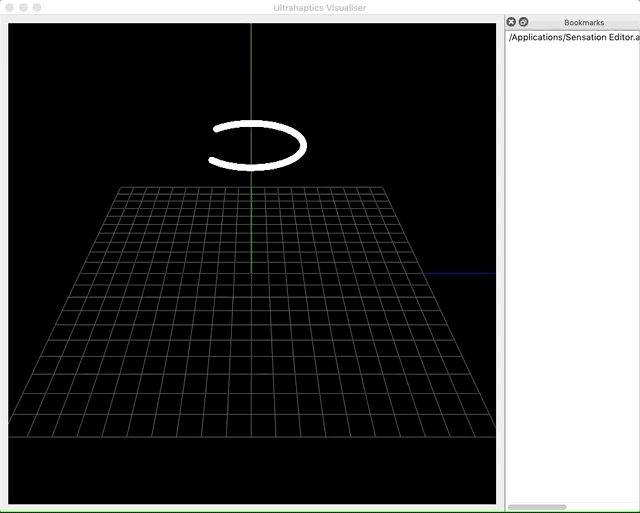

UHSDKLogViewer 
--------------
An SDK Log visualiser built with PyQt which plots control points in 3D space




Usage:
-------
1. Ensure that this file (UHSDKLogViewer.py) is executable by settings its permissions:
```$ chmod +x UHSDKLogViewer.py``` 
2. Run with -e (--exePath) flag from the command line, to launch an Ultrahaptics executable you wish to monitor
```
$ python3 UHSDKLogViewer.py -e=/path/to/my/process
```

Alternatively, run the compiled applications in the [Executables](https://github.com/ultrahaptics/ultrahaptics-labs/tree/master/UHSDKLogViewer/Executables) directory (Mac and Windows only)

Dependencies:
-------------
1. Python 3.7.x (http://python.org)
2. The following Python modules are required: pyqt5, pyqtgraph, numpy, PyOpenGL, atom
  The recommended way to install these via pip (for Python 3)
  To install with pip3 run this command:
```
$ pip3 install --user pyqt5 pyqtgraph numpy PyOpenGL atom
```
3. Windows only will also require: 
```
$ pip3 install --user pypiwin32
```

Building:
-------------
To build an executable (with all Python/Libraries bundled), you can use pyinstaller.

```
$ pip3 install pyinstaller
```
Then to build, cd into the src/ directory and run:
```
macOS:
$ pyinstaller -F -w UHSDKLogViewer.py -i ../icons/icon.icns

Windows:
$ pyinstaller.exe -F -w UHSDKLogViewer.py -i ../icons/icon.ico

```
